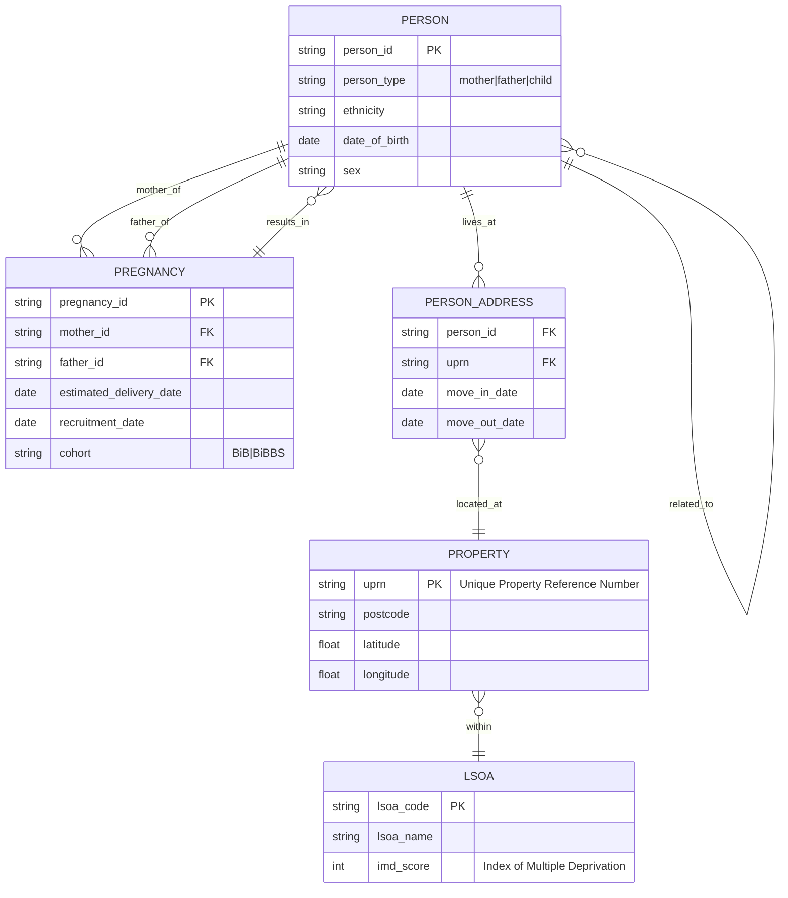
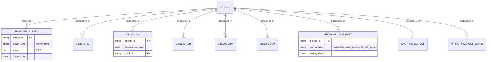
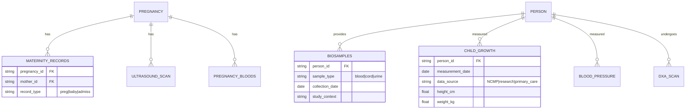
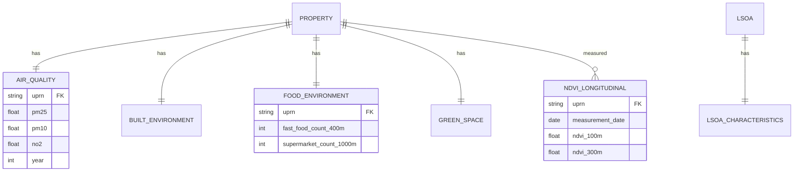
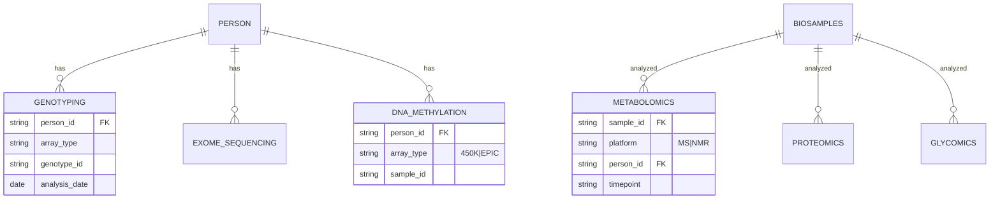
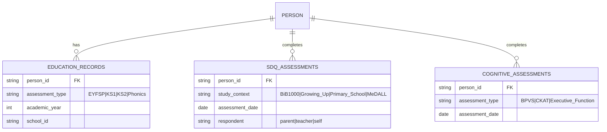
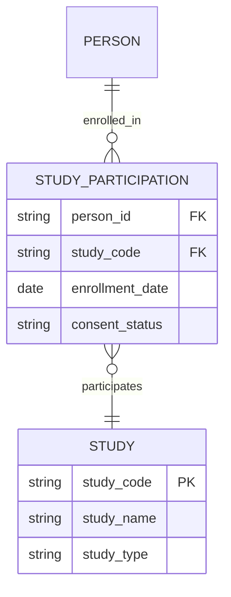
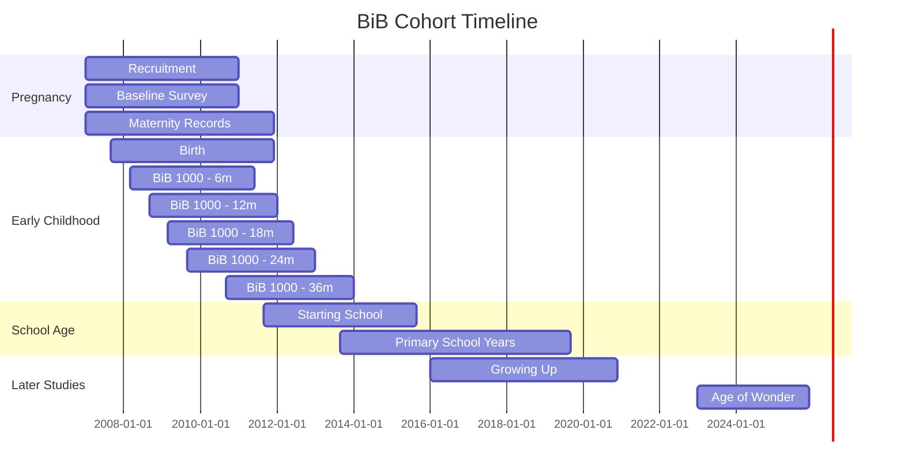

# Born in Bradford Data Model

This document describes the logical data model for the Born in Bradford cohort study, showing how tables and entities relate to each other.

## Overview

The BiB data model is organized around **people** (mothers, fathers, children), **pregnancies**, and **geographic locations**, with various data collected at different timepoints and through different studies.

## Core Entity-Relationship Model



## Data Domain Structure

### 1. Baseline & Survey Data



### 2. Health & Clinical Data



### 3. Geographic & Environmental Data



### 4. Omics & Biomarker Data



### 5. Education & Development Data



### 6. Sub-Study Participation



## Key Linkage Identifiers

### Primary Identifiers

| Identifier Type | Scope | Used In | Description |
|----------------|-------|---------|-------------|
| `person_id` | Person | All person-level tables | Universal identifier for individuals |
| `pregnancy_id` | Pregnancy | Pregnancy-related tables | Links pregnancy data to mother and infant |
| `uprn` | Property | Geographic tables | Unique Property Reference Number |
| `lsoa_code` | Geographic Area | LSOA-level data | Lower Layer Super Output Area code |

### Study-Specific Identifiers

| Study | Identifier | Links To |
|-------|-----------|----------|
| BiB 1000 | `bib1000_id` | Longitudinal questionnaires at 6m, 12m, 18m, 24m, 36m |
| MeDALL | `medall_id` | Allergy studies, skin prick tests |
| Age of Wonder | `aow_id` | School visits and surveys |
| Growing Up | `growingup_id` | Adult and child surveys, DXA scans |
| PLATOON | `platoon_id` | Dental study data |

### Omics Identifiers

| Data Type | Identifier | Links To |
|-----------|-----------|----------|
| Genotyping | `genotype_id` | Person via linkage table |
| Exome Sequencing | `exome_id` | Person via linkage table |
| DNA Methylation | `dnam_id` | Person via linkage table |
| Metabolomics | `sample_id` | Biosample → Person |

## Data Granularity Levels

The BiB data exists at multiple levels of granularity:

```
Individual (Person)
    ├── Single timepoint measurements
    ├── Longitudinal measurements
    │   ├── Baseline
    │   ├── 6 months
    │   ├── 12 months
    │   ├── 18 months
    │   ├── 24 months
    │   ├── 36 months
    │   └── School age (4-11 years)
    └── Life course linkage
        ├── Pregnancy data (mother)
        ├── Birth data (child)
        ├── Childhood data
        └── Adolescence data

Property (Address)
    ├── Static characteristics
    ├── Temporal measures (NDVI over time)
    └── Proximity measures (food environment, etc.)

Area (LSOA)
    ├── Deprivation indices
    ├── Census data
    └── Aggregated characteristics
```

## Temporal Data Structure

### Longitudinal Study Design



## Data Linkage Examples

### Example 1: Linking Mother's Pregnancy Data to Child Outcomes

```sql
-- Conceptual query structure
SELECT 
    p.person_id as child_id,
    pr.pregnancy_id,
    pr.mother_id,
    mb.biomarker_value as maternal_biomarker,
    cg.height_cm as child_height,
    ed.ks1_score
FROM person p
JOIN pregnancy pr ON p.pregnancy_id = pr.pregnancy_id
JOIN pregnancy_bloods mb ON pr.pregnancy_id = mb.pregnancy_id
JOIN child_growth cg ON p.person_id = cg.person_id
JOIN education_records ed ON p.person_id = ed.person_id
WHERE p.person_type = 'child'
```

### Example 2: Linking Person to Geographic Environment

```sql
-- Conceptual query structure
SELECT 
    p.person_id,
    pa.uprn,
    aq.pm25,
    ge.green_space_300m,
    fe.fast_food_count_400m,
    l.imd_score
FROM person p
JOIN person_address pa ON p.person_id = pa.person_id
JOIN property prop ON pa.uprn = prop.uprn
JOIN air_quality aq ON prop.uprn = aq.uprn
JOIN green_environment ge ON prop.uprn = ge.uprn
JOIN food_environment fe ON prop.uprn = fe.uprn
JOIN lsoa l ON prop.lsoa_code = l.lsoa_code
WHERE pa.move_out_date IS NULL  -- Current address
```

### Example 3: Longitudinal Within-Person Analysis

```sql
-- Conceptual query structure
SELECT 
    person_id,
    '6m' as timepoint, assessment_date, bmi_zscore 
FROM bib1000_6m
UNION ALL
SELECT 
    person_id,
    '12m', assessment_date, bmi_zscore 
FROM bib1000_12m
UNION ALL
SELECT 
    person_id,
    '18m', assessment_date, bmi_zscore 
FROM bib1000_18m
ORDER BY person_id, assessment_date
```

## Data Model Notes

### Design Principles

1. **Person-Centric**: Most data links back to individual persons via `person_id`
2. **Temporal Tracking**: Many tables include date fields for longitudinal analysis
3. **Hierarchical Geography**: Person → Address → Property → LSOA structure
4. **Study Flexibility**: Sub-study IDs allow participants to be in multiple studies
5. **Family Linkage**: Related pairs table captures family relationships

### Common Join Patterns

| To Link | Via |
|---------|-----|
| Mother's pregnancy data → Child's outcomes | `pregnancy.pregnancy_id` |
| Siblings | `related_pairs` table with `relationship_type = 'sibling'` |
| Mother-Child pairs | `pregnancy` table links mother_id to child via pregnancy_id |
| Person → Geographic environment | `person_id → person_address → uprn → property` |
| Longitudinal person data | Same `person_id` across different timepoint tables |
| Omics data → Person | Linkage tables (e.g., `genotyping_info`) |

### Data Cardinality

- **One Person** → Many addresses over time (residential moves)
- **One Pregnancy** → One mother, optionally one father, one or more children (twins)
- **One Person** → Many biosamples (different types, timepoints)
- **One Person** → Many SDQ assessments (different studies, timepoints)
- **One Property** → Many people over time
- **One LSOA** → Many properties

## Accessing the Data Model in the Dictionary

To explore these relationships in detail:

1. Open [docs/bib_cohortinfo_id_linkage.html](docs/bib_cohortinfo_id_linkage.html) for ID definitions
2. Check [docs/bib_cohortinfo_related_pairs.html](docs/bib_cohortinfo_related_pairs.html) for family relationships
3. Navigate to specific data domains to see available variables
4. Review linkage sections for omics data integration

## Version Information

- **Model Version**: 1.0
- **Last Updated**: February 2026
- **Based on**: BiB Data Dictionary Repository Structure
